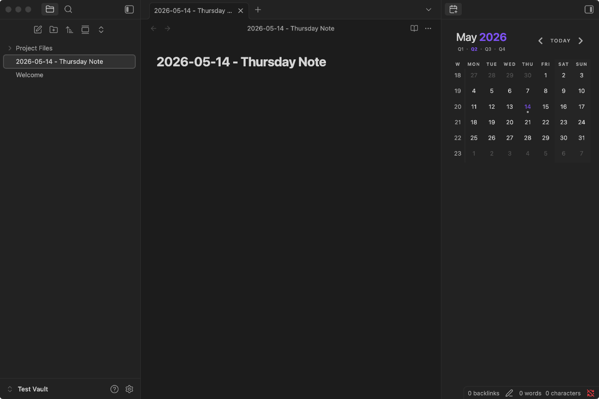

# Calendar Plus

Calendar Plus is a sidebar calendar for [Obsidian](https://obsidian.md/) with daily, weekly, monthly, quarterly, and yearly periodic notes built in. It's an update to [Liam Cain's original Calendar plugin](https://github.com/liamcain/obsidian-calendar-plugin), with a few notable updates and differences:

1. **Periodic notes are integrated.** Daily, weekly, monthly, quarterly, and yearly notes are configured directly in Calendar Plus — no separate Periodic Notes plugin required.
2. **Month, year, and quarter labels are clickable.** Click the labels in the calendar header to open or create the corresponding periodic note, the same way day and week-number cells work.
3. **Dots default to "a note exists."** By default, a dot on a day or week-number cell simply indicates that the corresponding note exists. If you prefer richer indicators, the **Dot style** setting can show word-count dots and an open-task dot for daily and weekly notes.

There are also many bug fixes that bring both the calendar view and periodic note functionality up to modern Obsidian plugin standards.



## Features

- A calendar view for navigating your vault by date.
- Built-in periodic notes for daily, weekly, monthly, quarterly, and yearly periodicities. Each periodicity has its own folder, filename format, and optional template — no separate Periodic Notes plugin required.
- Click a day cell to open or create that day's note. Click a week-number cell to open or create the weekly note. Click the month, year, or quarter labels in the calendar header to open or create the corresponding monthly / yearly / quarterly note.
- By default, a filled dot on a day cell means a periodic note exists for that day, and a dot on a week-number cell means a weekly note exists. The optional **Dot style** setting can switch this to word-count dots plus an open-task dot for daily and weekly notes.
- The calendar view can live anywhere. Drag it to the left sidebar, into the main content area, pin it as a tab, or pop it into its own window — Calendar Plus preserves the placement across plugin reloads.
- Theme-friendly: the calendar inherits Obsidian's CSS variables and respects the active theme out of the box.

## Installation

**From within Obsidian** (recommended once listed in the community-plugin directory): Settings → Community plugins → Browse → search "Calendar Plus" → Install → Enable.

**From a GitHub release** (fallback): download `main.js`, `manifest.json`, and `styles.css` from a [GitHub release](https://github.com/mattmaiorana/calendar-plus/releases), copy them into your vault at `<vault>/.obsidian/plugins/calendar-plus/`, then enable Calendar Plus from Settings → Community plugins.

**From source**: see the [Development](#development) section below.

Calendar Plus uses a separate plugin id, view type, and ribbon icon from the original Calendar plugin, so the two can coexist during a transition.

## Usage

After enabling the plugin, the calendar appears in the right sidebar. You can drag it elsewhere or pin it — the placement is remembered.

Daily notes are enabled by default for new installs. Weekly, monthly, quarterly, and yearly notes start disabled; toggle each on as needed.

Configure each periodic-note type independently from Settings → Calendar Plus → Periodic Notes:

- **Enable** turns the note type on. Enabling Weekly notes also shows the week-number column.
- **Date format** is a [Moment.js format string](https://momentjs.com/docs/#/displaying/format/) used for note filenames.
- **Folder** is where notes for that periodicity are created. Leave blank for the vault root.
- **Template file** is an optional path to a template note.

Calendar Plus owns its own settings for all five periodic-note types and doesn't read from Obsidian's core Daily Notes plugin or other periodic-notes plugins.

### Settings

#### General

- **Start week on**: choose the first day of the week. "Locale default" uses your system locale.
- **Ctrl/Cmd + Click Behavior**: when Ctrl/Cmd-clicking any calendar item — a day cell, week-number cell, or the month/quarter/year header label — open the note in a new tab or in a new split.
- **Confirm before creating new note**: show a confirmation modal before creating a new note. Turn off for one-click creation.
- **Change week number side**: show week-number cells on the right side of the calendar instead of the left. (Shown under Weekly notes when Weekly notes are enabled.)
- **Shade weekend columns**: tint weekend day columns so they stand out from weekdays. Off by default.
- **Weekend days**: when weekend shading is enabled, choose which days count as weekend (default Saturday + Sunday). Independent of **Start week on** — week start controls column order, not which columns are shaded.
- **Dot style**: choose what the dots on day and week cells represent. "Note exists" (default) shows a single dot when the corresponding daily/weekly note exists. "Word count and open tasks" shows filled dots based on word count plus one hollow dot when the note has open `- [ ]` / `* [ ]` tasks.
- **Words per dot**: when **Dot style** is set to "Word count and open tasks", this controls how many words count as one filled dot (default 250). Dots are capped at 5 per cell.
- **Show Today button on mobile**: shows the Today button in the mobile calendar header. Off by default. Desktop always shows the Today button.

#### Periodic Notes

Each of the five note types — Daily, Weekly, Monthly, Quarterly, Yearly — has its own Enable toggle, Date format, Folder, and Template file setting.

#### Advanced

- **Override locale**: force a specific locale for date formatting, independent of your system locale.

## FAQ

### Does Calendar Plus replace the original Calendar plugin?

It's intended to. Calendar Plus uses a separate plugin id, view type, and ribbon icon from the original Calendar plugin, so the two can coexist if you want to run them side-by-side during a transition. Calendar Plus owns its own settings for all five periodic-note types and does not read settings from Obsidian's core Daily Notes plugin or the original Periodic Notes plugin.

### What do the dots mean?

By default, a filled dot on a day cell means a periodic note exists for that day, and a dot on a week-number cell means a weekly note exists. If you'd like dots to reflect word count and open tasks instead, switch the **Dot style** setting to "Word count and open tasks" — daily and weekly notes will then show filled dots based on word count plus one hollow dot when the note has open `- [ ]` or `* [ ]` tasks.

### How do I add week numbers to the calendar?

Enable **Weekly notes** in the Calendar Plus settings. Week-number cells appear automatically; clicking one opens or creates the weekly note for that week.

### How do I have the calendar start on Monday?

From the Settings tab, use the **Start week on** dropdown.

### How do I hide the calendar without disabling the plugin?

Right-click the calendar's view icon in the sidebar and choose Close. Reopen it later from the Command Palette: `Calendar Plus: Open view`.

### How do I include literal words in a weekly note filename?

Wrap the words in `[]` brackets in your Moment.js format string. For example, `[Week] ww [of Year] gggg` produces filenames like `Week 21 of Year 2020`. The brackets tell Moment.js to treat the enclosed text literally instead of as format tokens.

## Tips

### Embed each day of a week in a weekly note

Add this snippet to your weekly note template to embed each day's note:

```md
## Week at a Glance

![[{{sunday:gggg-MM-DD}}]]
![[{{monday:gggg-MM-DD}}]]
![[{{tuesday:gggg-MM-DD}}]]
![[{{wednesday:gggg-MM-DD}}]]
![[{{thursday:gggg-MM-DD}}]]
![[{{friday:gggg-MM-DD}}]]
![[{{saturday:gggg-MM-DD}}]]
```

### Hover preview

Hold Ctrl or Cmd while hovering a day cell to preview the corresponding daily note.

### Open in a split

Ctrl/Cmd-click any calendar item — a day cell, a week-number cell, or a month/quarter/year header label — to open the note in a new tab or new split, depending on the **Ctrl/Cmd + Click Behavior** setting.

### Jump to today

Click the **Today** button in the calendar header to jump back to the current month. If Daily notes are enabled, this also opens or creates today's daily note. The Today button is shown on desktop by default and is hidden on mobile unless **Show Today button on mobile** is turned on.

### Reveal an open periodic note on the calendar

Run `Calendar Plus: Reveal active note` from the Command Palette to scroll the calendar to the month containing the currently-open periodic note.

### Style weekends differently

Set `--color-background-weekend` in your `obsidian.css` to any color to distinguish weekend columns.

### Weekly-note template tags

When a weekly note is created from a template, Calendar Plus expands these tags:

| Tag | Description |
| --- | --- |
| `{{sunday:fmt}}` through `{{saturday:fmt}}` | Inserts the date of that day of the current week, formatted with `fmt`. Specify the format explicitly (e.g. `{{sunday:gggg-MM-DD}}`). |
| `{{title}}` | The note's filename. |
| `{{date:fmt}}`, `{{time:fmt}}` | The date / time of the first day of the week, formatted with `fmt`. |

## Customization

Calendar Plus exposes CSS variables you can override in your `obsidian.css`:

```css
#calendar-container {
  --color-background-heading: transparent;
  --color-background-day: transparent;
  --color-background-weeknum: transparent;
  --color-background-weekend: transparent;

  --color-dot: var(--text-muted);
  --color-arrow: var(--text-muted);
  --color-button: var(--text-muted);

  --color-text-title: var(--text-normal);
  --color-text-heading: var(--text-muted);
  --color-text-day: var(--text-normal);
  --color-text-today: var(--interactive-accent);
  --color-text-weeknum: var(--text-muted);
}
```

To override specific calendar classes, prefix them with `#calendar-container` so the change doesn't leak into the rest of Obsidian:

```css
#calendar-container .year {
  color: var(--text-normal);
}
```

**Note for theme authors:** if you inspect the calendar's DOM, you'll see class names with autogenerated suffixes such as `.day.svelte-abc123.svelte-abc123`. The `svelte-…` portion is generated at build time, changes between releases, and is **not** a stable styling API. Target only the human-readable part of the class — `.day`, `.week-num`, `.month`, etc. — and prefix with `#calendar-container` so your overrides apply to Calendar Plus specifically.

## Compatibility

Calendar Plus 1.7.14 and later require Obsidian 1.8.7 or newer. Users on older Obsidian builds can remain on Calendar Plus 1.7.13 through Obsidian's version-compatibility mechanism.

## Development

```sh
npm ci          # install dependencies from the lockfile
npm run build   # type-check, lint, and bundle to main.js
```

`main.js` is generated by the build and shouldn't be edited directly. See [CHANGELOG.md](./CHANGELOG.md) for release history and [FUTURE_PLANS.md](./FUTURE_PLANS.md) for deferred work.

## Changelog

See [CHANGELOG.md](./CHANGELOG.md) for release-by-release notes.

## License

Calendar Plus is released under the [MIT License](./LICENSE).

## Credits

Calendar Plus began as a fork of [Liam Cain's Obsidian Calendar plugin](https://github.com/liamcain/obsidian-calendar-plugin), draws on ideas from [Liam Cain's Periodic Notes plugin](https://github.com/liamcain/obsidian-periodic-notes), and was inspired by [FBarrca's Obsidian Calendar fork](https://github.com/FBarrca/obsidian-calendar-plugin/releases). It has since evolved into its own integrated calendar + periodic-notes plugin.

Thanks also to the Obsidian developer community for the plugin API and documentation.
